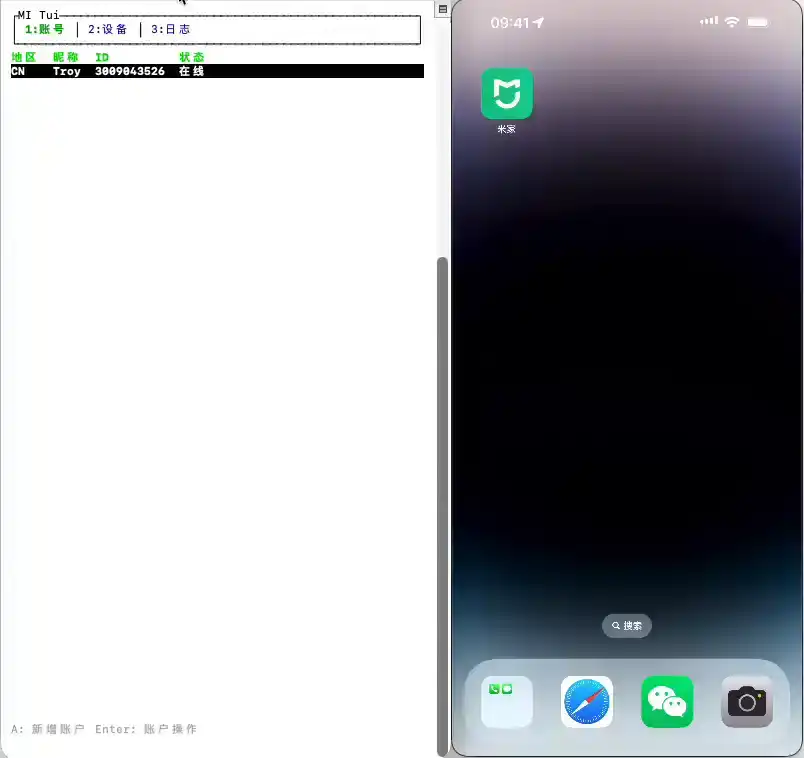
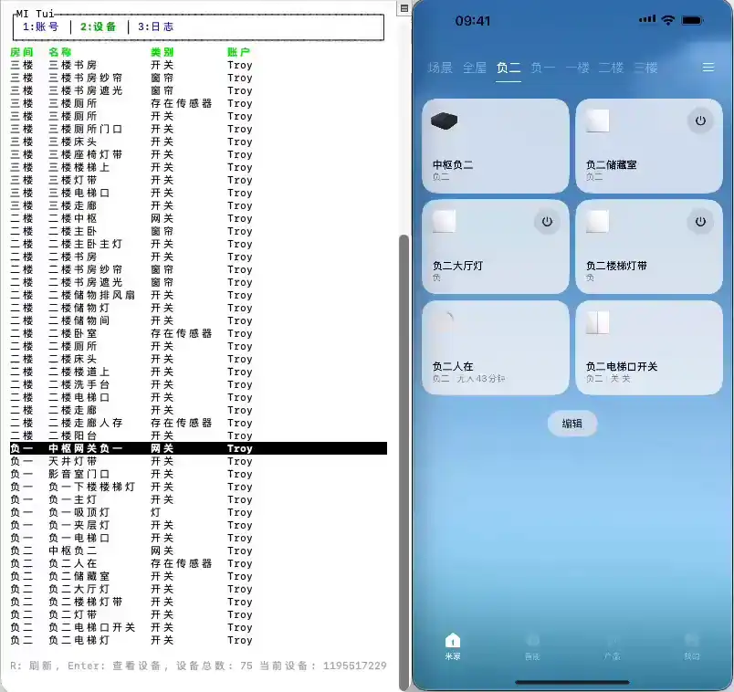

# MIT(MI-Terminal)

<p align="center">
  <strong>轻量级小米智能家居 CLI 与全屏 TUI 设备控制台</strong>
  <br/><br/>
  <a href="LICENSE"></a>
  <a href="https://github.com/ttys026/mit/releases/latest"></a>
  <a href="https://github.com/ttys026/mit/actions/workflows/release.yml"></a>
  
  <br/><br/>
  <a href="README.md">English</a>
</p>

---

`mit` 是一款用 Rust 编写的快速、轻量级小米智能家居 CLI 工具。无需打开 App，即可在终端中登录小米账号、浏览并控制智能设备、发送推送通知。

> **免责声明：** 本项目为社区维护工具，与小米公司无隶属关系，未获得小米官方认可或授权。

## 功能特性

- **全屏 TUI** — 键盘驱动，浏览账号、房间和设备，读写 MIoT 属性，触发 Action
- **本地优先局域网控制** — 自动探测设备本地 IP 和 token，优先走局域网 UDP/MIIO 协议，不可达时无缝回退到云端
- **CLI 属性操作** — 不启动 TUI 直接读写设备属性、触发 Action，或订阅属性变化
- **推送通知** — 向任意已登录的小米账号发送消息
- **多账号** — 支持不同区域的多个账号同时登录
- **JSON 输出** — 支持 `--json` 模式，方便脚本和自动化集成

---

## 演示

| 发送推送通知                               | 读写设备属性                                | TUI(移动端视图)                            |
| ------------------------------------------ | ------------------------------------------- | ------------------------------------------ |
|  |  |  |

---

## 安装

**一键安装（macOS / Linux）：**

```bash
curl -sSfL https://raw.githubusercontent.com/ttys026/mit/main/install.sh | sh
```

脚本会自动检测平台、下载最新预编译二进制文件、校验 SHA-256 完整性，并安装到 `/usr/local/bin`（若无写权限则安装到 `~/.local/bin`）。

**从源码构建（需要 Rust ≥ 1.75）：**

```bash
cargo install --git https://github.com/ttys026/mit.git --bin mit
```

**自定义安装目录：**

```bash
INSTALL_DIR=~/.local/bin curl -sSfL https://raw.githubusercontent.com/ttys026/mit/main/install.sh | sh
```

### 支持平台

| 平台          | x86_64 | aarch64 |
| ------------- | ------ | ------- |
| Linux (musl)  | ✅     | ✅      |
| Linux (glibc) | ✅     | ✅      |
| macOS         | ✅     | ✅      |
| Windows       | ✅     | ✅      |

---

## 快速开始

```bash
# 1. 登录小米账号
mit auth login

# 2. 查看设备列表
mit devices list

# 3. 启动全屏 TUI
mit tui
```

---

## 命令一览

```bash
# 查看帮助
mit
mit --help

# ── 账号管理 ────────────────────────────────────────────────
mit auth login                                   # 先登录小米，再扫码登录米家
mit auth login --region cn                       # 指定小米登录区域
mit auth login xiaomi                            # 只登录小米 OAuth
mit auth login mijia                             # 只登录米家二维码
mit auth list                                    # 列出已保存的账号
mit auth logout                                  # 登出（仅有一个账号时）并删除其缓存
mit auth logout --uid 1001                       # 登出指定账号

# ── TUI ────────────────────────────────────────────────────
mit tui                                          # 启动全屏控制台
mit tui --uid 1234567                            # 以指定账号启动

# ── 设备 ───────────────────────────────────────────────────
mit devices list                                 # 列出所有账号下的设备

# ── 三方平台 ───────────────────────────────────────────────
mit third-party list                             # 列出已绑定三方平台及设备
mit third-party sync                             # 同步已绑定三方设备状态
mit third-party sync --uid 1001                  # 只同步指定账号

# ── 推送通知 ────────────────────────────────────────────────
mit push "Hello World"                           # 向所有账号推送
mit push --uid 1001 "Hello World"                # 向指定账号推送

# ── MIoT 属性与 Action（无需 TUI）─────────────────────────
mit props get did-1 2 1                          # 读取属性（siid=2, piid=1）
mit props set did-1 2 1 true                     # 写入属性
mit props act did-1 5 1 1 2                      # 触发 Action 并传入参数
mit props sub                                    # 订阅所有设备属性变化
mit props sub did-1                              # 订阅单个设备的所有属性变化
mit props sub did-1 2 1                          # 订阅单个属性

# ── 设备历史与统计（米家）──────────────────────────────────
mit logs did-1 2.1                               # 查看属性 2.1 的操作记录
mit logs did-1 2.1 3.1 --limit 100               # 多个键，每个最多 100 条
mit stats did-1 3.1 --period week                # 查看某个键的统计（week|month|year）

# ── 维护 ───────────────────────────────────────────────────
mit cache clean                                  # 删除设备/规格缓存（保留登录）
mit reset --yes                                  # 删除 ~/.mit 下的全部数据（需要 --yes）
```

### 说明

- 浏览器完成授权后，`mit auth login` 会自动完成认证，并在浏览器中显示成功页面。
- `mit props get/set/act/sub` 可以直接使用，无需进入 TUI。
- `mit props sub` 会将 Cloud MIPS MQTT 订阅日志和属性变化实时输出到 stdout，直到手动中断。
- `mit tui` 会同步设备并将 MIoT 规格缓存到 `~/.mit/cache/specs/`。
- 直接运行 `mit auth` 兼容 `mit auth --help` 的帮助展示行为。
- 直接运行 `mit devices` 兼容 `mit devices --help` 的帮助展示行为。

### TUI 分栏

1. `1:账号` — 账号列表、登录/登出、推送消息
2. `2:设备` — 设备列表与属性/动作对话框
3. `3:日志` — 运行日志与状态信息
4. `4:设置` — 清理缓存（保留授权）与重置全部设置（删除 `~/.mit`，双重确认）

---

## 本地优先局域网控制

`mit` 优先通过局域网（UDP/MIIO 协议）与设备通信，而非通过小米云端：

1. 首次同步时，`mit` 从小米云端获取每台设备的 `localip` 和 `token`。
2. 凭据按账号持久化保存到 `~/.mit/accounts/{account_id}/local_credentials.json`。
3. `mit` 在后台探测每台设备的局域网可达性。

---

## JSON 输出

命令支持全局 `--json` 标志，输出机器可读的 JSON：

```bash
mit --json                  # 帮助信息（JSON 格式）
mit --json auth list        # 账号列表（JSON 格式）
mit --json devices list     # 设备列表（JSON 格式）
mit --json third-party list # 已绑定三方平台及设备（JSON 格式）
mit --json third-party sync # 三方设备同步结果（JSON 格式）
mit --json push "hello"     # 推送结果（JSON 格式）
```

- `--json` 只影响成功时的标准输出。解析错误和运行时错误始终以可读文本输出到标准错误。
- `mit props sub` 等流式命令会将实时文本行输出到 stdout，不支持 `--json`。
- 此特性使 `mit` 易于在脚本、CI 流水线或任何需要结构化输出的自动化场景中使用。

---

## 配置

| 环境变量                                      | 说明                                                      |
| --------------------------------------------- | --------------------------------------------------------- |
| `MIT_PROFILE_DIR` / `MIT_HOME` / `XMCLI_HOME` | 覆盖 `~/.mit` 数据目录                                    |
| `MIT_MIOT_SPEC_URL_BASE`                      | 覆盖 MIoT 规格 API 基础 URL（适用于测试）                 |
| `MIT_MICO_BASE_URL`                           | 覆盖 Mico API 基础 URL（仅 debug 构建）                   |
| `MIT_LOG_DEVICE_LIST_PAGE_RAW`                | 设置为任意非空值，可将原始设备列表 API 响应输出到标准错误 |

数据存储在 `~/.mit/` 目录下：

```
~/.mit/
├── auth.json                          # 已保存的账号 token
├── accounts/{uid}/
│   ├── devices.json                   # 设备列表
│   └── local_credentials.json         # 每账号局域网凭据
└── cache/
    └── specs/
        ├── index.json                 # 型号 → URN 映射
        ├── models/                    # 每型号 MIoT 规格 JSON
        └── sources/                   # 缓存的 MIoT API 索引文件
```

---

## 开源许可

[MIT](LICENSE)
